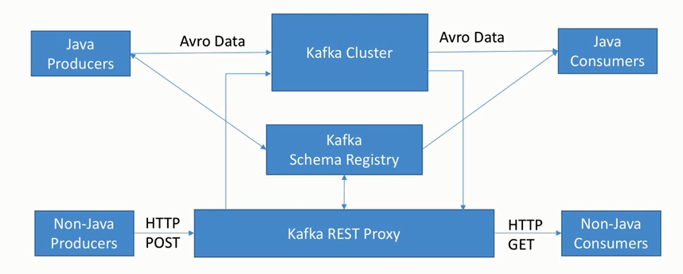

# Confluent schema registry p.2

## Intro

In this article we will take a look at REST of Confluent Schema Registry and Confluent REST Proxy. 
Communication workflow of schema registry and proxy viewed on diagram.

It is important to mention that Confluent Schema Registry and REST Proxy can be scaled horizontally and be part of cluster. 
Both components are parts of the Confluent Open Source distribution.



[Source](https://www.hackersdenabi.net/wp-content/uploads/2018/03/Avro.png)

## Content

1. Confluent Schema registry. REST. 
2. Confluent REST Proxy.
  2.1 binary
  2.2 json 
  2.3 avro
3. Additional. 

##1. Confluent Schema registry. REST.

todo: REST subjects -> ref to [K_GO](https://github.com/sysco-middleware/KGO) project

##2. Confluent REST Proxy.

[Postman Collection](https://www.getpostman.com/collections/a1b9f77045de1df58314), please import to Postman.

> The proxy provides a RESTful interface to a Kafka cluster, making it easy to produce and consume messages, view the state of the cluster, and perform administrative actions without using the native Kafka protocol or clients.

Important to set correct headers, when produce or consume records, depends on record format.
If Confluent REST Proxy fail, it will try to close all consumers.

**Request Headers**  

`Accept: application/vnd.kafka.v2+json`  

`Content-Type:application/kafka.[.embedded_format].[api_version]+[serialization_format]`  


|                                     |                     |
| -------------                       |:-------------:      |
| embedded_format                     | binary, json, avro  |
| api_version                         | v2                  |
| serialization_format                | json                |


Produce & Consume operations: 

| Type        | Format            |
| ------------- |:-------------:  |
| binary        | bytes (base64)  |
| json          | json            |
| avro          | encoded json    |

*Producer*
* Produce request supports batching. 
* Partition can be specified for record(s) in batch.

*Consumer*   

Consuming kafka records via HTTP 1.1 is a bit complex. 

Steps:
1. Create consumer instance for specific consumer group. Use (*returned by REST Proxy*) URL for next step.
2. Subscribe consumer to kafka topic(s).
3. Consume records. 
4. Commit offset.
5. Delete consumer instance, close the consumer with a DELETE to make it leave the group and clean up its resources. 

`NB!`  
If on step 4 processing time will be longer than `max.poll.interval.ms` timeout, client will receive `500`.  
If on step 5 the post body is empty, it commits all the records that have been fetched by the consumer instance.

###2.1 Binary

**Produce**

[base64 encoder/decoder](http://www.utilities-online.info/base64),  data will be send in base64 encoded format.

```
POST /topics/topic-binary-records HTTP/1.1
Host: kafkaproxy.example.com
Content-Type: application/vnd.kafka.binary.v2+json
Accept: application/vnd.kafka.v2+json, application/vnd.kafka+json, application/json

{
  "records": [
    {
      "key": "U3lzY28tbWlkZGxld2FyZQ==",
      "value": "aHR0cHM6Ly9zeXNjby5uby8="
    },
    {
      "value": "aHR0cHM6Ly9zeXNjby5uby8="
    },
    {
      "value": "aHR0cHM6Ly9zeXNjby5uby8=",
      "partition": 0
    }
  ]

```

**Consume**  

1. Create consumer (once)
2. Use returned by REST Proxy URL for consuming
3. Get records
4. Process (depends on application)
5. Commit offset
6. Delete, close the consumer with a DELETE to make it leave the group and clean up its resources. 

### Json

Produce & Consume operations with json are similar to binaries, the main differences are headers.

```
Content-Type: application/vnd.kafka.json.v2+json
Accept: application/vnd.kafka.v2+json, application/vnd.kafka+json, application/json

```

### Avro

The REST Proxy has primary support for Avro as it is directly connected to the Schema Registry.
Record can be send with `schema_value` (contains schema payload) either with `schema_value_id`(only schema id, schema should exists) 

``` 
POST /topics/topic-avro-records HTTP/1.1
Host: kafkaproxy.example.com
Content-Type: application/vnd.kafka.avro.v2+json
Accept: application/vnd.kafka.v2+json, application/vnd.kafka+json, application/json

{
  "value_schema": "{\"type\": \"record\",\"name\": \"Business\",\"fields\":[{\"name\": \"first_name\", \"type\": \"string\"},{\"name\" :\"last_name\",  \"type\": \"string\"}]}",
  "records": [
    {
      "value": {"first_name": "sysco", "last_name":"middleware" }
    },
    {
      "value": {"first_name": "nikita", "last_name": "zhevnitksiy"},
      "partition": 0
    }
  ]
}

```

Response body with success statusno will contain `value_schema_id` which can be used for futher request instead of `value_schema` field.

`NB!` Note that if you use Avro values you must also use Avro keys, but the schemas can differ. 


##3. Additional 

!TODO
 
Confluent REST Proxy provides most of the functionality of the Java producers and consumers.
Most metadata about the cluster could be accessible via `GET` requests. 

**Topics**  
Topics operations are read-only.   
`GET /topics`  
`GET /topics/{name}`


## References 

[Kafka REST Proxy](https://docs.confluent.io/current/kafka-rest/docs/index.html)

